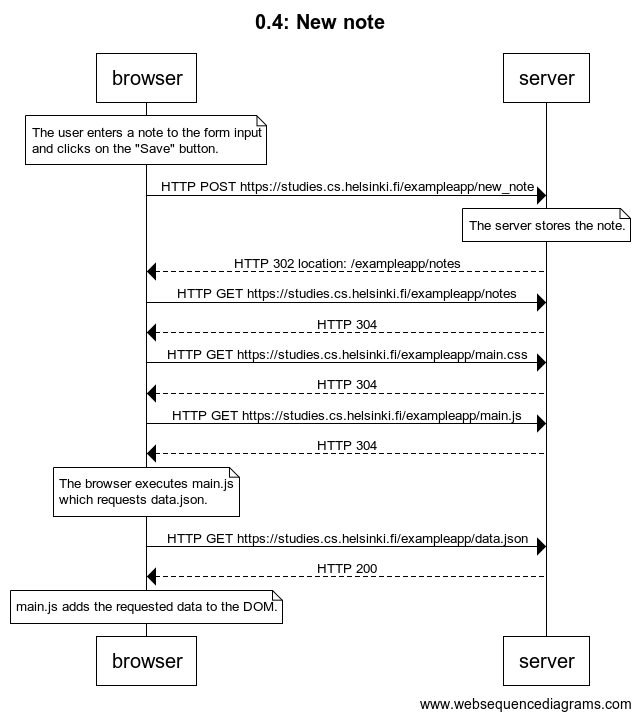

# 0.4: New note



```
title 0.4: New note

note over browser:
The user enters a note to the form input
and clicks on the "Save" button.
end note

browser->server: HTTP POST https://studies.cs.helsinki.fi/exampleapp/new_note

note over server:
The server stores the note.
end note

server-->browser: HTTP 302 location: /exampleapp/notes

browser->server: HTTP GET https://studies.cs.helsinki.fi/exampleapp/notes
server-->browser: HTTP 304

browser->server: HTTP GET https://studies.cs.helsinki.fi/exampleapp/main.css
server-->browser: HTTP 304
browser->server: HTTP GET https://studies.cs.helsinki.fi/exampleapp/main.js
server-->browser: HTTP 304

note over browser:
The browser executes main.js
which requests data.json.
end note

browser->server: HTTP GET https://studies.cs.helsinki.fi/exampleapp/data.json
server-->browser: HTTP 200

note over browser:
main.js adds the requested data to the DOM.
end note
```
